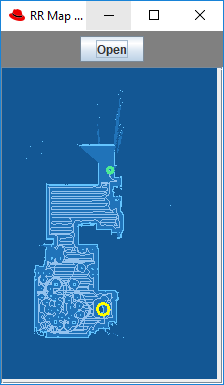
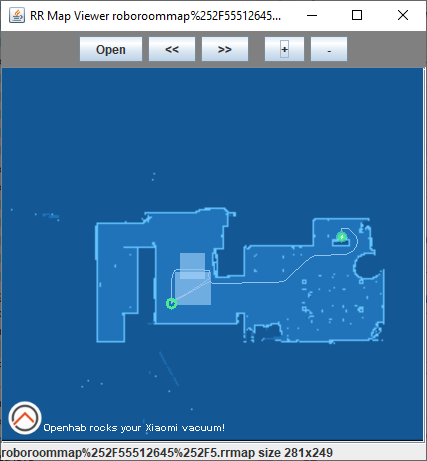
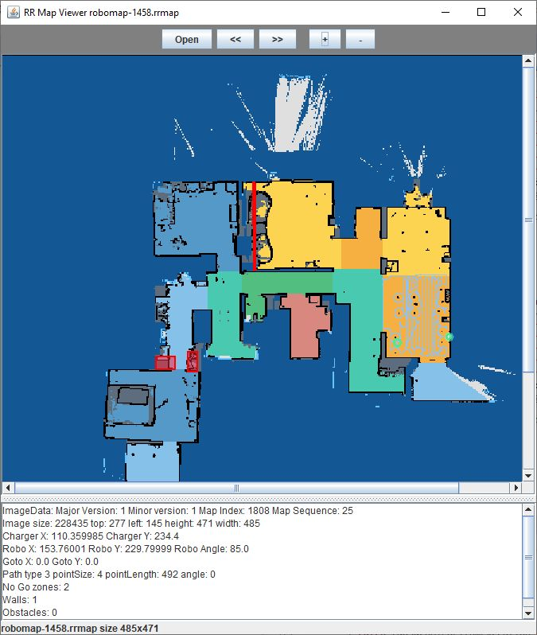

RR Map file format and proof of concept file reader

File format description here [RRFileFormat.md](RRFileFormat.md)

Basic decorder (work in progress) [RRDraw.java](RRDraw.java)

Decoded with concept reader for map v1.1

