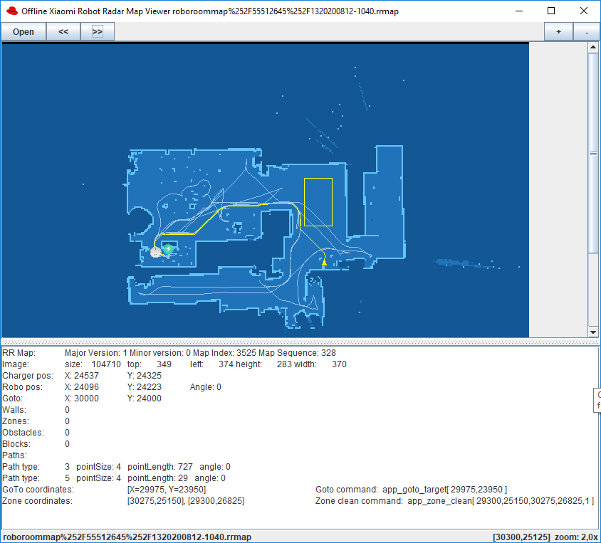

RR Map file format and proof of concept file reader

File format description here [RRFileFormat.md](RRFileFormat.md)

Offline viewer  [roboMapViewer2.5.7.zip](roboMapViewer2.5.7.zip) To run the viewer `java -jar RoboMapviewer2.5.7.jar` (assuming java is in your path, and the viewer is in the current dir, otherwise add the paths appropriately)

Source of offline viewer (included in openHAB miio binding): https://github.com/openhab/openhab-addons/blob/2.5.x/bundles/org.openhab.binding.miio/src/test/java/org/openhab/binding/miio/internal/RoboMapViewer.java 

Decoded with concept reader for map v1.1

