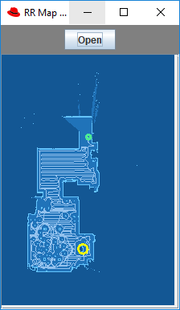
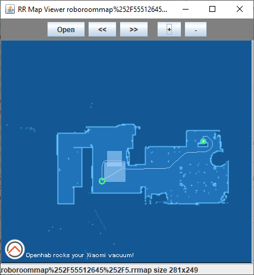
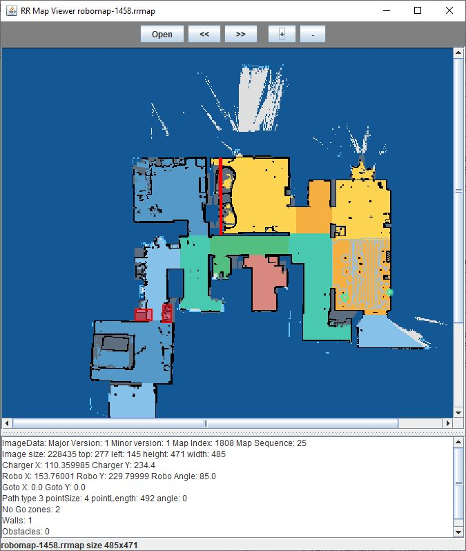
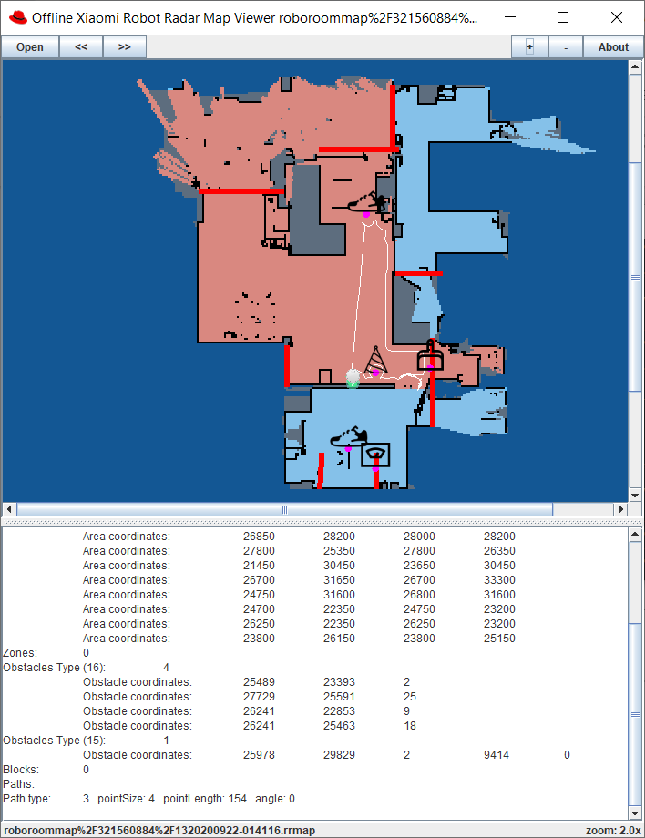

# Roborock map file format (RR map)

[Home](../README.md) / [Maps](../docs/maps/index.md) / RR map file format

The map the robot produces is a **gzip-compressed** binary file ("RR file") consisting of a header and a sequence of typed blocks. In Mi Home the file is not returned by the RPC: the RPC returns a file name, the plugin downloads the object and un-gzips it ([how](../docs/concepts/maps-overview.md#how-a-map-reaches-the-app)).

This page was verified against the **app's own map parser** shipped in every plugin bundle (`raw/*_parser_workermapparser.jx`, `Schema` table, 42 parsers; method: [methodology](../docs/methodology.md)). Layouts marked *confirmed* agree with the legacy text, *extended* means the legacy text was incomplete, *new* means the block was not documented before. The machine-readable block table is [`data/map_blocks.json`](../data/map_blocks.json); a Kaitai description is [`roborock_map_file.ksy`](roborock_map_file.ksy) (it covers block types ≤ 19 only and is unchanged).

## Conventions

- All integers are little-endian.

- **Coordinates** stored in the file are millimetres; the app divides them by `Scale = 50` to get map pixels (one pixel = 50 mm). Zones and points sent *to* the robot ([`app_zoned_clean`](../docs/commands/cleaning-control.md#app_zoned_clean), [`app_goto_target`](../docs/commands/cleaning-control.md#app_goto_target)) use the same millimetre frame.
- "scaled" below means the app divides the value by 50. Obstacle coordinates are **not** scaled in the app.
- The y axis of the file points up while image rows count downwards: for a position at image row `r` the app uses `y = top + height − r` (pixel units; ✅ Bundle · a65 m12218 `getZoneParams`, `getGotoTarget`).

## Framing

The parser reads blocks sequentially. Every block starts with a prefix:

| Offset | Size | Field |
|---:|---:|---|
| 0 | 2 | block type |
| 2 | 2 | header length (bytes from the start of the block to the payload) |
| 4 | 4 | payload length |

The next block starts at `start + header length + payload length`. Block fields listed as *header* below follow the prefix inside the header; the *record* layout describes the payload. Unknown block types are skipped by length.

### File header and validation

The file begins with a block of type `0x7272` (the ASCII characters `rr`) whose header carries:

| Field | Size |
|---|---:|
| major version | 2 |
| minor version | 2 |
| map index | 4 |
| map sequence | 4 |

so the file header is 20 bytes long (header length field = 0x14 in the samples of the legacy text). Before decoding, the app checks the downloaded file (✅ Bundle · a65@1.0.95 · m10052 `MapValidator`; the validator, recognised by its SHA-1 routine and function names, is present in all 42 bundles; a65 is quoted):

1. the first two bytes are the ASCII text `rr`;
2. `header length + payload length` (u16 at offset 2, u32 at offset 4) equals the length of the whole file, i.e. the payload length of the file header is the length of **everything after the file header**, not an offset to a footer as the legacy text said;
3. the last 20 bytes of the file equal the SHA-1 of all bytes in front of them (the digest table of the validator lists map version 1.0 in all readable bundles and 1.1 in all of them except a11, m1s, p5, t4, t6 and v1; the digest-table lines of the minified bundles were not read);
4. the lengths of all following blocks add up to the payload length.

⚪ Legacy documented the same header fields ("0x00 `RR`, 0x02 header length, 0x04 data length, 0x08 major, 0x0A minor, 0x0C map index, 0x10 sequence").

## Block types

Parsers = how many of the 42 analysed parsers know the block.

| Id | Name used by the app | Legacy name | Title | Header fields | Record layout | Parsers | Status |
|---:|---|---|---|---|---|---:|---|
| 1 | `charger` | `charger` | Charger location | - | x u32, y u32 (scaled), angle u32 (angle only when the payload is 12 bytes long) | 42 | extended |
| 2 | `map` | `map` | Image (map pixels) | [blockNum u32 (newer parsers)], top u32, left u32, height u32, width u32 | 1 byte per pixel, row-major; low 3 bits = pixel type (0 = outside/unknown, 1 = obstacle/wall, other values = floor), high 5 bits = room (segment) id 0–31 | 42 | extended |
| 3 | `path` | `path` | Vacuum path | num u32, size u32, angle u32 | x u16, y u16 (scaled); `size` bytes per point | 42 | confirmed |
| 4 | `pathGoto` | `pathGoto` | Go-to path | num u32, size u32, angle u32 | x u16, y u16 (scaled) | 42 | confirmed |
| 5 | `pathGotoPlan` | `pathGotoPlan` | Predicted go-to path | num u32, size u32, angle u32 | x u16, y u16 (scaled) | 42 | confirmed |
| 6 | `zones` | `zones` | Cleaned zones | num u32 | 8 bytes: x1, y1, x2, y2 u16 (scaled) | 42 | confirmed |
| 7 | `target` | `target` | Go-to target | - | x u16, y u16 (scaled); ignored when both are 0 | 42 | confirmed |
| 8 | `robot` | `robot` | Robot position | - | x u32, y u32 (scaled), angle u32 (angle only when the payload is 12 bytes long) | 42 | confirmed |
| 9 | `fbzs` | `fbzs` | No-go zones | num u32 | 16 bytes: 8 × u16 (scaled) = four corner points | 42 | confirmed |
| 10 | `walls` | `walls` | Virtual walls | num u32 | 8 bytes: 4 × u16 (scaled) = two end points | 42 | confirmed |
| 11 | `blocks` | `blocks` | Blocks (active segments) | num u32 | 1 byte each (segment id) | 41 | confirmed |
| 12 | `mfbzs` | `mfbzs` | No-mop zones | num u32 | 16 bytes: 8 × u16 (scaled) | 41 | confirmed |
| 13 | `obstaclesOld`/`obstacles` | `obstaclesOld` | Obstacles (old layout) | num u32 | 5 bytes: x u16, y u16, type u8 (not scaled) | 36 | confirmed |
| 14 | `ignoredObstaclesOld` | `ignoredObstaclesOld` | Ignored obstacles (old layout) | num u32 | 5 bytes: x u16, y u16, type u8 | 34 | confirmed |
| 15 | `obstacles` | `obstacles` | Obstacles | num u32 | 16 bytes: x u16, y u16, type u16, u16 (confidence), u32, u32 — or 28 bytes with a photo reference: x, y, type, u16, u32, then 16 ASCII characters (empty when the byte at +12 is 0). The parser decides per block by testing the bytes at +12…+27. | 34 | extended |
| 16 | `ignoredObstacles` | `ignoredObstacles` | Ignored obstacles | num u32 | 6 bytes: x u16, y u16, type u16 | 34 | confirmed |
| 17 | `carpetMap` | `carpetMap` | Carpet map | - | one byte per pixel of the image (same geometry as block 2) | 32 | confirmed |
| 18 | `mopPath` | `mopPath` | Mop path | - | bytes, one per pixel | 32 | confirmed |
| 19 | `cfbzs` | `cfbzs` | Carpet forbidden areas | num u32 | 16 bytes: 8 × u16 (scaled) | 32 | confirmed |
| 20 | `pathType` | `pathType` | Path type | - | 1 byte | 25 | confirmed |
| 21 | `smartZones` | `smartZones` | Smart zones | num u32 | 18 bytes: zone id u16, range = x1,y1,x2,y2 u16 (scaled), 8 further bytes not read by the app | 22 | extended |
| 22 | `customCarpet` | `customCarpet` | Custom carpet | num u32 | 16 bytes: 8 × u16 (scaled) | 22 | confirmed |
| 23 | `clfbzs` | `clfbzs` | Carpet-line forbidden zones | num u32 | 16 bytes: 8 × u16 (scaled) | 22 | confirmed |
| 24 | `floorMap` | `floorMap` | Floor map | - | one byte per pixel (floor material) | 22 | confirmed |
| 25 | `furnitures` | `furnitures` | Furniture | num u32 | 23 bytes: 8 × u16 corner coordinates (scaled), u16 type, five single bytes | 22 | extended |
| 26 | `dockType` | `dockType` | Dock type | - | integer of the block length | 22 | confirmed |
| 27 | `enemies` | `enemies` | Enemies | num u32 | 6 bytes: x u16, y u16 (scaled), u16 | 22 | confirmed |
| 28 | `dsfbz` | `dsfbz` | Door-sill zones | num u32 | 16 bytes: 8 × u16 (scaled) | 16 | extended |
| 29 | `stuckpts` | `stuckpts` | Stuck points | num u32 | 6 bytes: x u16, y u16 (scaled), u16 | 16 | extended |
| 30 | `clffbz` | `clffbz` | Cliff zones | num u32 | 16 bytes: 8 × u16 (scaled) | 16 | extended |
| 31 | `smartds` | `smartds` | Smart door sills | num u32 | 16 bytes: 8 × u16 (scaled) | 16 | extended |
| 32 | `flDirec` | `flDirec` | Floor direction | - | 3 bytes per entry: u8, u16 | 16 | extended |
| 33 | `date` | `date` | Date | - | integer of the block length | 16 | extended |
| 34 | `nonceData` | `nonceData` | Nonce data | num u32 | 5 bytes: u8, u32 | 13 | extended |
| 36 | `extZones` | `extZones` | Extra zones | num u32 | 16 bytes: 8 × u16 (scaled) | 10 | new |
| 1024 | `digest` | `digest` | Digest | - | Not decoded by the block parser. The app validator (`MapValidator`) treats the last 20 bytes of the file as a SHA-1 digest of all bytes before them. | 42 | extended |

### Notes per block

- **1 Charger location**: The legacy doc lists x and y only; the app reads a third 4-byte field `angle`. The older sample file in this folder has an 8-byte payload (no angle), the newer sample a 12-byte payload.
- **2 Image (map pixels)**: Pixel byte `FF` of the legacy doc = floor (type 7) with room id 31. The parser caps room ids at 32 (`MaxBlockNum`). Header length 28 vs 24 = presence of `blockNum`; the first parser generation (v1) has no `blockNum`.
- **8 Robot position**: Same payload sizes as block 1 in the two sample files.
- **13 Obstacles (old layout)**: Every parser except those of s5 and t4 names block 13 `obstaclesOld`; the s5/t4 parsers call it `obstacles`.
- **15 Obstacles**: Coordinates are not scaled. The legacy .ksy names the u16 at +6 `confidence`.
- **25 Furniture**: A block whose length is not `num × 23` is ignored.
- **28 Door-sill zones**: The legacy doc marks the function as uncertain; the app uses the block with the door-sill editing calls ([`app_set_door_sill_blocks`](../docs/commands/rooms-and-areas.md#app_set_door_sill_blocks)).
- **34 Nonce data**: Used with incremental map downloads (nonce).
- **36 Extra zones**: Not in the legacy table or the .ksy; present in the parsers of 10 models. A block whose length is not `num × 16` is ignored.
- **1024 Digest**: Legacy text and the .ksy describe a 12-byte hash field; the validator in the bundles uses the full 20-byte SHA-1 (its digest table has entries for map versions 1.0 and, in most bundles, 1.1). The 8-byte block header lies inside the hashed range.

## Pixel values of the image block (type 2)

| Bits | Meaning |
|---|---|
| 0–2 (`pixel & 7`) | pixel type: `0` outside/unknown, `1` obstacle/wall, any other non-zero value = floor |
| 3–7 (`pixel >> 3`) | room (segment) id, 0–31; `0` = no room |

✅ Bundle · `convertMap` of the app parser; the .ksy declares the same split (`segment_id` b5, `type` b3). The legacy table "00 outside, 01 wall, FF inside" is the special case type 7 / room 31.

## Obstacle types

The `type` field of blocks 13–16 is mapped to a display name by the app; the table is in [other enumerations](../docs/reference/other-enums.md#obstaclenames) (the bundles that carry the table are listed there).

## Parser generations

Models whose plugin parser knows the same set of block ids (extra ids relative to the first row):

| Block ids known | Count | Models |
|---|---:|---|
| 11 block ids + file header 0x7272: 1, 2, 3, 4, 5, 6, 7, 8, 9, 10, 1024 | 1 | v1 |
| 13 block ids + file header 0x7272: 11, 12 | 5 | a01 c1 e2 m1s t6 |
| 14 block ids + file header 0x7272: 13 | 2 | s5 t4 |
| 17 block ids + file header 0x7272: 14, 15, 16 | 2 | a11 p5 |
| 20 block ids + file header 0x7272: 17, 18, 19 | 7 | a08 a09 a10 a19 s4 s5e s6 |
| 21 block ids + file header 0x7272: 20 | 3 | a14 a15 a23 |
| 28 block ids + file header 0x7272: 21, 22, 23, 24, 25, 26, 27 | 6 | a34 a37 a38 a40 a52 a62 |
| 34 block ids + file header 0x7272: 28, 29, 30, 31, 32, 33 | 3 | a29 a30 a76 |
| 35 block ids + file header 0x7272: 34 | 3 | a51 a69 a70 |
| 36 block ids + file header 0x7272: 36 | 10 | a26 a27 a46 a64 a65 a66 a72 a73 a74 a75 |

Which of these ids a *firmware* writes is not determinable from the bundles; the table shows what the app can decode. The legacy note "map v1.1 / blocks 9–12 only with newer firmware" matches the generation split above (blocks 11 and 12 appear in every parser except the first one).

## Files in this folder

| File | What it is |
|---|---|
| [`roborock_map_file.ksy`](roborock_map_file.ksy) | Kaitai Struct description (block types 1–19 and 1024) |
| [`RRDraw.java`](RRDraw.java) | proof-of-concept drawing code (legacy) |
| [`roboMapViewer2.5.7.zip`](roboMapViewer2.5.7.zip), [`roboMapViewer2.5.9-1.zip`](roboMapViewer2.5.9-1.zip) | offline viewers (legacy; the newer one also decodes identified obstacles) |
| `roboroommap%252F55512646%252F6.rrmap` (this folder), [`../roboroommap-with-objects.rrmap`](../roboroommap-with-objects.rrmap) (repository root) | sample map files (the first file name contains a literal `%252F`, so it is not linked) |
| `DecodedSample.png`, `decodedRegion.png`, `rrmap-v11.jpg`, `robomapobjects.png` | decoded examples |

Source of the offline viewer (openHAB binding): <https://github.com/openhab/openhab-addons/tree/main/bundles/org.openhab.binding.miio>. Latest viewer: [openHAB forum thread](https://community.openhab.org/t/xiaomi-vacuum-map-viewer-to-find-coordinates-for-zone-cleaning/103500).

## See also

- [Maps overview](../docs/concepts/maps-overview.md)
- [Map commands](../docs/commands/maps.md)
- [README of this folder](README.md)
